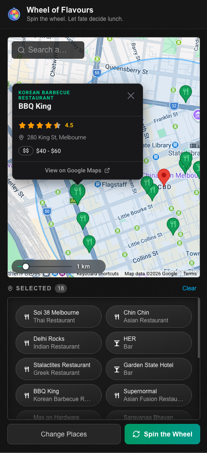
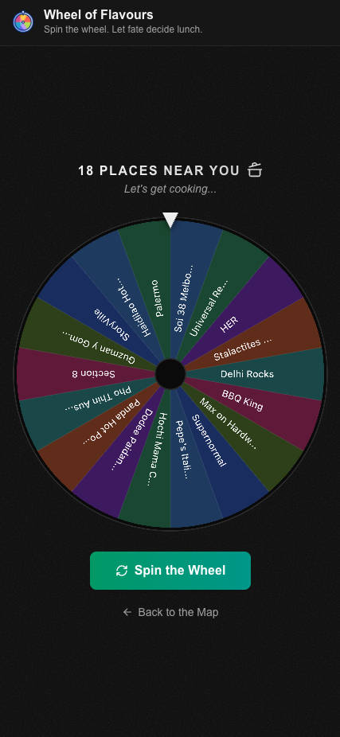
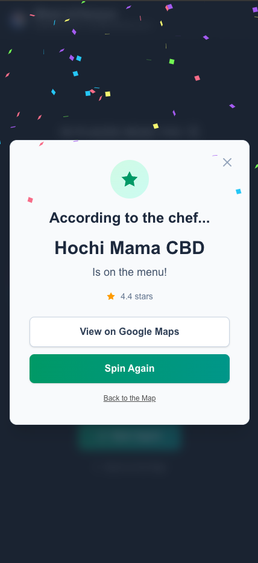

# 🍽️ Flavour of the Week

| Map view | Spin the wheel | Recommended restaurant |
|----------|----------------|-------------------------|
|  |  |  |

**Flavour of the Week** is an interactive web application designed to solve the age-old question: "Where should we eat for lunch?" Built for office teams and individuals who struggle with decision fatigue, this tool discovers nearby restaurants, cafes, and eateries, then gamifies the selection process with a fun spinning wheel interface.

## 🎯 Problem Statement

Making group lunch decisions can be time-consuming and frustrating. This application streamlines the process by:

- Automatically discovering nearby dining options based on your location
- Filtering results by distance and preferences
- Adding an element of fun through a randomized wheel spinner
- Providing essential information (ratings, distance, type) at a glance

## ✨ Features

- **📍 Location-Based Search**: Automatically detects your location or allows manual address input
- **🗺️ Interactive Map**: Nearby places with custom markers; tap or click a marker for an info window (ratings, address, price) and a “View on Google Maps” link. Radius slider in the bottom-left corner; clicking the map with an info window open closes it without moving the search centre
- **🎡 Spinning Wheel**: Custom Canvas wheel with a curated colour palette, radial text labels, smooth ease-out animation, and responsive sizing — no third-party wheel library
- **📱 Responsive Design**: Optimized for both desktop and mobile with adaptive layout, drawer on mobile, and full-viewport spin page
- **⭐ Smart Filtering**: Ratings, distance, and establishment types in list and map info windows to inform your choices
- **🎨 Modern UI**: Dark theme with subtle background texture, global “Wheel of Flavours” header, accessible contrast (WCAG-friendly greys), and minimal controls (e.g. radius slider) that stay readable over the map

## 🛠️ Tech Stack

- **Framework**: [Next.js 16](https://nextjs.org/) (React 19) with App Router
- **Language**: TypeScript
- **Styling**: [Tailwind CSS 4](https://tailwindcss.com/)
- **State Management**: [Zustand](https://github.com/pmndrs/zustand)
- **Data Fetching**: [TanStack Query (React Query)](https://tanstack.com/query/latest)
- **Maps**: [Google Maps API](https://developers.google.com/maps) via [@vis.gl/react-google-maps](https://visgl.github.io/react-google-maps/)
- **Wheel**: Custom Canvas-based spinning wheel with responsive sizing, radial text rendering, and ease-out animation
- **UI Components**: Custom components with [Vaul](https://vaul.emilkowal.ski/) (drawer), [Lucide React](https://lucide.dev/) (icons)
- **Testing**: [MSW (Mock Service Worker)](https://mswjs.io/) for API mocking
- **Code Quality**: ESLint, Prettier with import sorting and Tailwind class ordering ([prettier-plugin-tailwindcss](https://github.com/tailwindlabs/prettier-plugin-tailwindcss)); project conventions in `.cursor/rules/` (e.g. `cn` and grouped class names for Tailwind)

## 🚀 Getting Started

### Prerequisites

- Node.js 20+ installed
- [mkcert](https://github.com/FiloSottile/mkcert) for generating local SSL certificates
- A Google Maps API key with the following APIs enabled:
  - Maps JavaScript API
  - Places API (New)
  - Geocoding API

### Installation

1. Clone the repository:

```bash
git clone https://github.com/yourusername/lunch-wheel-of-fortune.git
cd lunch-wheel-of-fortune
```

2. Install dependencies:

```bash
npm install
```

3. Generate SSL certificates for HTTPS development:

   The application requires HTTPS to use the Geolocation API. Generate self-signed certificates using mkcert:

   **First, install mkcert** (if not already installed):

   ```bash
   # macOS
   brew install mkcert

   # Linux (Debian/Ubuntu)
   sudo apt install mkcert

   # For other platforms, see: https://github.com/FiloSottile/mkcert#installation
   ```

   **Then, create the certificates:**

   ```bash
   # Install the local CA (one-time setup)
   mkcert -install

   # Create certificates directory
   mkdir -p certificates

   # Generate localhost certificates
   mkcert -key-file certificates/localhost-key.pem -cert-file certificates/localhost.pem localhost
   ```

   This will create:
   - `certificates/localhost-key.pem` - Private key
   - `certificates/localhost.pem` - Certificate

   > **Note**: The `certificates/` directory is already in `.gitignore` to prevent committing sensitive certificate files.

4. Set up environment variables:

   Create a `.env.local` file in the root directory:

   ```env
   NEXT_PUBLIC_GOOGLE_MAPS_API_KEY=your_api_key_here
   ```

5. Run the development server:

```bash
npm run dev
```

6. Open [https://localhost:3000](https://localhost:3000) in your browser

> **Note**: The dev server runs with HTTPS enabled for geolocation API compatibility. You may see a security warning on first visit - this is expected with self-signed certificates and safe to proceed.

## 📖 Usage

1. **Set Your Location**: Enter an address or allow the app to use your current location
2. **Adjust Search Radius**: Use the slider to control how far you want to search (up to 5km)
3. **Browse Results**: View nearby restaurants on the map and in the list view
4. **Select Options**: Check the boxes next to restaurants you're interested in
5. **Spin the Wheel**: Click "Spin the Wheel" to randomly select from your choices
6. **View Winner**: See the selected restaurant with options to view on the map or spin again

## 🏗️ Project Structure

```
src/
├── app/                   # Next.js App Router
│   ├── layout.tsx         # Root layout with global header
│   ├── page.tsx           # Main map and selection interface
│   └── spin/              # Wheel spinner page
├── components/            # Shared UI (site header, skeleton, providers)
├── css/                   # Global and map-specific styles
├── features/              # Feature-based modules
│   ├── menu/              # Restaurant search and map
│   │   ├── components/    # Map, advanced markers, lists, radius slider, address input
│   │   ├── hooks/         # Geolocation, places, autocomplete
│   │   └── utils/         # Map utilities
│   └── wheel/             # Canvas wheel, prize modal, spin button
├── lib/                   # API client, constants, helpers (e.g. Google Maps URLs), utils
├── mocks/                 # MSW mock handlers for development
├── store/                 # Zustand (map state, selected places)
└── types/                 # TypeScript type definitions
```

## 🧪 Development

### Available Scripts

- `npm run dev` - Start development server with Turbopack and HTTPS
- `npm run build` - Build for production
- `npm start` - Start production server
- `npm run lint` - Run ESLint

### Code Standards

This project follows modern best practices:

- **Functional Programming**: Modular, reusable functions with single responsibilities
- **Component Architecture**: Well-organized, feature-based structure with clear separation (menu vs wheel, shared components)
- **Type Safety**: Full TypeScript coverage
- **Styling**: Tailwind CSS with `cn()` for class composition and grouped, multi-line class names (see `.cursor/rules/tailwind-classnames.mdc`)
- **Accessibility**: Contrast and focus handling aligned with WCAG where applicable (e.g. map info windows, form controls)
- **Code Quality**: Prettier (import sorting + Tailwind class ordering), ESLint, conventional commits
- **Performance**: React 19, Turbopack, and lazy loading (e.g. wheel canvas)

## 🤝 Contributing

Contributions are welcome! This project is ideal for developers looking to:

- Work with modern React and Next.js features
- Integrate with Google Maps APIs
- Build responsive, user-friendly interfaces
- Practice TypeScript and state management

### How to Contribute

1. Fork the repository
2. Create a feature branch (`git checkout -b feat/amazing-feature`)
3. Commit your changes (`git commit -m 'feat: adds amazing feature'`)

- Adhere to conventional commit message standards; see [Conventional Commits](https://www.conventionalcommits.org/en/v1.0.0/)

5. Push to the branch (`git push origin feat/amazing-feature`)
6. Open a Pull Request

Please ensure your code:

- Follows the existing code style (Prettier will auto-format)
- Includes appropriate TypeScript types
- Is modular and well-documented
- Passes all linting checks

## 📝 License

This project is open source and available under the [MIT License](LICENSE).

## 🙏 Acknowledgments

- Built with [Next.js](https://nextjs.org/) by Vercel
- Maps powered by [Google Maps Platform](https://developers.google.com/maps)
- Icons from [Lucide](https://lucide.dev/)

## 📧 Contact

For questions, suggestions, or issues, please open an issue on GitHub.

---

**Made with ❤️ to solve the eternal lunch dilemma**
